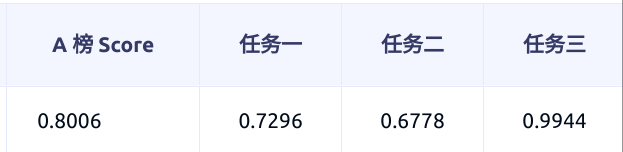
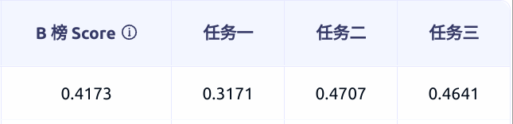
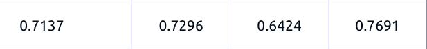

# 2024AI4S-Cup---LLM-Challenge
2024AI4S Cup - LLM挑战赛 - 大模型提取“基因-疾病-药物”知识图谱 rank7方案

比赛官网：[https://bohrium.dp.tech/competitions/3793785610?tab=introduce&postId=4905459778](https://bohrium.dp.tech/competitions/3793785610?tab=introduce&postId=4905459778)

**A榜**：



**B榜**：



A榜的最优结果并没有使用到A榜的测试集训练，在使用外部数据时也对A榜测试集进行了过滤，因此不存在泄漏的问题，但是AB榜的gap还是很大。

A榜只使用官方提供数据的最优结果如下，可以看到和B榜的gap仍然很大。



### 算法流程

#### （0）环境搭建
```sh
pip install -r requirements.txt
```

#### （1）数据预处理
除了官方提供的数据之外，还使用到了额外的数据集（其实官方数据也来自于此）。

task1的额外数据集：[http://lit-evi.hzau.edu.cn/AGAC-CHIP2022/](http://lit-evi.hzau.edu.cn/AGAC-CHIP2022/)

task2的额外数据集：[https://github.com/JHnlp/BioCreative-V-CDR-Corpus](https://github.com/JHnlp/BioCreative-V-CDR-Corpus)

task3的额外数据集：[https://github.com/isegura/DDICorpus](https://github.com/isegura/DDICorpus)

执行以下预处理命令来处理数据，一共有4种数据处理方式（data_format=1,2,3,4），下面会作解释：
```sh
python data_preprocess.py --data_format 1
```

模板如下（以mistral为例）：
```
<s> [INST] ### Abstract ###\n{abstract}\n\n\n### Question ###\n{instruction} [/INST]{response}</s>
```

task1 prompt：
```
Please extract (gene, FUNCTION CHANGE, disease) triplets from the given literature abstract, and output all the triplets in tuple format. And the possible types of FUNCTION CHANGE include: 
(1) 'GOF' refers to the gain of function or the emergence of new functions when a gene or protein undergoes mutation. This may include increasing or altering protein expression levels, enhancing activity, or causing it to be expressed at the wrong time or location. Gain of function mutations can lead to some abnormal phenomena, such as increased cell proliferation, increased metabolic rate, or triggering abnormal signal transduction.
(2) 'LOF' refers to the partial or complete loss of function when a gene or protein undergoes mutation. This may include missing or altering the protein's structural domain, causing the protein to fail to fold properly or interact with other molecules. Loss of function mutations often lead to functional defects, which may cause genetic diseases or abnormal physiological manifestations.
(3) 'COM' refers to the more complex functional changes between genes and diseases, which may include both GOF and LOF.
(4) 'REG' refers to general regulation, without specifying whether it is a GOF or a LOF.
If there are no (gene, FUNCTION CHANGE, disease) triplets in the abstract, please answer 'There are no (gene, FUNCTION CHANGE, disease) triplets.'.
```

task2的示例：
```
Please extract (chemical, disease) relations from the given literature abstract, and output all the relations in tuple format. If there are no (chemical, disease) relations in the abstract, please answer 'There are no (chemical, disease) relations.'
```

task3的示例：
```
Please extract (drug, interaction, drug) triplets from the given literature abstract, and output all the triplets in tuple format. If there are no (drug, interaction, drug) triplets in the abstract, please answer 'There are no (drug, interaction, drug) triplets.'
Note that the possible types of interaction include: 'advise', 'effect', 'int' and 'mechanism'.
```

#### （2）模型微调

**实验设计**：
- **微调方式**：本项目采用了lora, lora plus, dora三种微调方式；
- **预训练模型**：本项目均采用了开源的指令微调后的模型（指令遵循的能力更强，能更好的理解所构建的prompt），采用biomistral-7b，mistral-7b-instruct-v0.2以及gemma-7b-it；
- **精度**：fp16 or bf16;
- **多任务**：由于三元组和二元组的提取本身和实体关联较大，所以加入实体提取的任务训练来增强LLM对于医疗相关实体的理解，本项目主要对比了四种方式：（1）直接构造实体提取的prompt和response，和三元组提取的任务一起训练；（2）在（1）的基础上，推理的时候在三元组的输入中添加模型提取的实体信息；（3）将三元组的提取任务拆分为step by step的流程，让模型在一次生成中依次提取实体和三元组（4）模型训练阶段在输入中添加实体信息，并添加（1）中的实体任务，用于在推理时填充输入的实体信息。

由于task3在加入额外数据集之后在A榜表现比较好，所以就没有构造实体任务了。

不同任务的构造模板如下（以mistral为例）：
```
第一种：
三元组template：<s> [INST] ### Abstract ###\n{abstract}\n\n\n### Question ###\n{triplet_instruction} [/INST]{triplet_response}</s>
实体template：<s> [INST] ### Abstract ###\n{abstract}\n\n\n### Question ###\n{entity_instruction} [/INST]{entity_response}</s>

第二种：
推理：<s> [INST] ### Abstract ###\n{abstract}\n\n\n### Question ###\n{triplet_instruction} [/INST]{triplet_response}</s>

第三种：
<s> [INST] ### Abstract ###\n{abstract}\n\n\n### Entities ###\n{entities}\n\n\n### Question ###\n{instruction} [/INST]{entity_response}\n{triplet_response}</s>

第四种：
三元组template：<s> [INST] ### Abstract ###\n{abstract}\n\n\n### Entities ###\n{entities}\n\n\n### Question ###\n{triplet_instruction} [/INST]{triplet_response}</s>
实体template：<s> [INST] ### Abstract ###\n{abstract}\n\n\n### Question ###\n{entity_instruction} [/INST]{entity_response}</s>
```


**实验结果**：

- a. 不同微调方式的结果优劣：dora > lora > lora plus，使用dora的方式最优，但是线上提交notebook总是被kill，未提交成功；
- b. 在预训练模型上mistral-7b-instruct-v0.2效果最优，gemma在fp16精度下没收敛，而在bf16下可以收敛，但是由于线上评分使用的v100不支持bf16,所以最终没用gemma；
- c. 多任务的构造上方式（1）效果最优，A榜能带来1-2个点的提升，方式（4）次优；
- d. 由于不同task数据量差异明显，分别训练每个task比联合训练的效果更优，因为采用peft的方式微调，所以在参数量上并没有增加过多的额外参数。


**执行以下命令进行模型微调**：
```sh
分开训练 lora
sh scripts/train_mistral_lora_task1.sh 
sh scripts/train_mistral_lora_task2.sh
sh scripts/train_mistral_lora_task3.sh  

dora
sh scripts/train_mistral_dora_task1.sh 
sh scripts/train_mistral_dora_task2.sh
sh scripts/train_mistral_dora_task3.sh

lora-plus
sh scripts/train_mistral_loraplus_task1.sh 
sh scripts/train_mistral_loraplus_task2.sh
sh scripts/train_mistral_loraplus_task3.sh

```


#### （3）模型推理

执行以下命令来进行模型推理：
```sh
sh scripts/test.sh
```

### 参考内容

本项目基本Llama-factory进行开发的：[https://github.com/hiyouga/LLaMA-Factory](https://github.com/hiyouga/LLaMA-Factory)

以及比赛中分享的数据集：[https://bohrium.dp.tech/competitions/3793785610?tab=discuss&postId=4905459778](https://bohrium.dp.tech/competitions/3793785610?tab=discuss&postId=4905459778)
